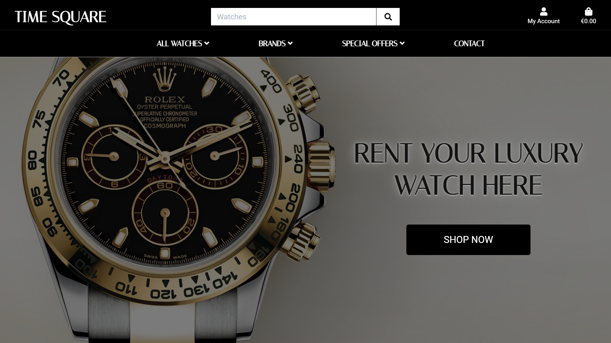

# Time Square - an e-commerce site which allows customers to rent luxury watches  

<p align="center">  

     

</p> 

*** 

## Introduction 

Time Square is an e-commerce site which enables customers to rent luxury watches on a price per week basis. The watches available are very expensive yet highly desireable, and would cost between €10k and €300k each to purchase from a store. Those prices make the availeble watches very difficult to obtain for the average person, and in fact for the majority of the general public. Most customers would be looking to rent a luxury watch for a special occasion, such as a wedding, holiday, honeymoon, ceremony, etc. 

The website can be viewed on Desktop, Tablet and Mobile devices.  

  
Link to Live Website [here](https://time-square.herokuapp.com/)   

   
 ***  

 ## Index – Table of Contents   


* [User Experience](#User-Experience)  

* [Features](#Features)  

* [Technologies](#Technologies)  

* [Testing](#Testing)  

* [Deployment](#Deployment)    

* [Acknowledgements](#Acknowledgements)  

***  

# User Experience

## Goals 

### Time Square goals 

The goal of this website is to allow users, who cannot afford to buy a luxury watch, the ability to rent a luxury watch at a price per week. 

### Target audience is: 

* People who cannot afford to buy a luxury watch. 
* People who would like to wear a different watch for a specific reason/ocassion. 
* People who like to change their watches throughout the year. 
* People who have a special ocassion to attend. 
* Any age group. 

### Business goals 

* Interactive website. 
* Fully functional website. 
* Intuitive design. 
* Easy to navigate. 
* To have as many registered users as possible. 
* Daily increases in user numbers. 
* Daily increases in reviews being added. 
* Make it as easy as possible for customers to complete a rental purchase. 
* Interactive communications with the customers at every stage of the rental process. 

### Customer goals 

* Easy to navigate. 
* Easy to search for specific keywords. 
* Easily locate a product. 
* Easy to add and edit information. 
* Easy to register and login securley. 
* Email communication when an action is completed. 
* Personal profile showing order history and modifiable billing details.

*** 

### User Stories 

### Time Square business 

As a business I want

* My website to display clean, sleek lines and mechanical colours. 
* My website to display simple to follow instructions. 
* My website to be responsive on all devices. 
* A strong focus on mobile usability as most users will be veiwing the website on mobile devices. 
* My website to be interactive and offer real time feedback. 
* My website to load quickly. 
* My website to display clear high resolution images. 
* My website to be usable for both left and right handed users. 
* My website to have a low risk of accidently clicking more than one button at once on smaller screens sizes. 
* My website to have a search function. 
* My website to have a admin login so the site can be managed. 

### The potential customer 

As a customer I want: 

* The website to be responsive on all devices. 
* To be able to access all of the pages from the Homepage. 
* To be able to conduct a keyword search from any page. 
* To be able to easily register an account. 
* To be able to easily login. 
* To be able to easily search by brand. 
* To be able to set my profile prefences. 
* To be able to access my basket from any page. 
* To be able to access the Homepage from any page. 
* To be able to adjust the items in the basket. 
* To be able to see real time feedback when compelting an action. 
* To be able to recieve email communications confirming the actions completed. 
* To be able to read reviews on each product. 
* To be able to add/edit/delete my own reviews. 
* To be able to contact the business for any reason and to recieve confirmation of this action. 
* To be able to view my past purchase history. 

### The UX designer

As a UX designer, I want:

* To track the user behaviour so that I can improve the user experience. 
* To track the user behaviour so that I can identify the possible user confusion over navigating the website. 
* To focus on the mobile design as most users will be using the website on a mobile device. 
* The website to be intercative and give real time feedback when a user executes an action. 

### Minimum Viable Product

All the User Stories have been assessed against value and complexity. Due to the relatively short time for the implementation of the website, only the MVPs will be implemented in the first release, but this is a project that I would like to expand on and improve. 

### Design
#### Colours

-  `#000 - Black`
-  `#555 - Davy's grey`
-  `#fff - White`
-  `#17a2b8 - Cyan`
-  `#6c757d - Pompeii Ash`

### Fonts
* Italiana - Used in Headings, hero text due to the sense of elegance it adds
* Roboto - for paragraphs, links and forms

# Features 

### Existing Features 

* Fully responsive website across all popular devices, using Bootstrap Grid and custom media queries. 
* Responsive Navigation Menu 
* Intuitive and responsive Navigation menu. 
* Registration & Login Forms 
* Login and Registration pages with forms. 
* Search Functionality - Search bar available on all pages with the ability to locate any keywords. 
* Homepage Navigation - Ability to naviagte to the Homepage from anywhere on the site. 
* Product Reviews - Each individual watch has a reviews section which users can add/edit/delete from when logged in. 
* Shopping Bag Summary - Products summary appears as toast and on a new page allowing the user to update/delete the details. 
* Checkout page that allows the user to enter personal/payment details to complete the transaction. 
* Checkout Success Page to confirm whether or not a payment was successful. 
* Order Confirmation Email - User will recieve an email confirming the details of their rental purchase. 
* Contact - A contact form which allows users to contact the business and the user recieves a confirmation email once successfully completed. 
* 404 & 500 Pages 
* Customised pages to match the design of the rest of the website. 
* Admin dashboard for Admin/Superuser that allows complete admin control over orders, accounts, users, products categories and more


### Features left to implement 


Product Ratings - The site currently shows ratings for each product, however this is hard wired into the database and cannot be changed by the users. For the next release I would like to create the functionality so that users can score each watch with a rating which displays in real time. 

Tracking User Behaviour - Use an analytics tool such as Hotjar or Google analytics to view user behaviour. 

Most and Least Visited Pages on the Site - Use an analytics tool such as Hotjar to understand where the traffic is going on the site.

Adding an equal number of ladies and gents watches and providing a filtering option to display appropriate user choice.


### Bugs and Fixes for Future Releases After Testing 


Image Size and Hosting - Some images haven't been sized to the uniform dimensions, due to time constraints and other responsibilites, I haven't had the chance to resize images in photoshop, but this can be fixed via fixtures, uploading correctly sized images to AWS S3 bucket, also through the admin panel or on the website itself via logging in as a Superuser/ Admin. 

***

# Technologies

### Languages:

* HTML
* CSS
* JavaScript
* Python

### Libraries & Frameworks:

* Bootstrap - used for responsive grid system, styling and toasts.
* JQuery - were used in conjunction with the Materialize library.
* FontAwseome - used for all icons on the site.
* Google Fonts - used for the Italiana and Roboto font.
* Unsplash - used for images.
* Django - a Python framework.

### Media Storage:

* Amazon Web Services - Cloud storage for static and media files

### Tools:

* Gitpod - used as IDE for this project.
* Git - used for version control.
* Github - used to host repository.
* Heroku - used to deploy.
* Figma - used for creation of mockups.
* Google Chrome DevTools - used for testing purposes as well as creating the image to display the web pages on different devices.
* Google Chrome DevTools - used for testing and debugging.
* PageSpeed insights - used for testing the loading speed of the site.
* Lighthouse Audit - used to test whether the site meets the standards expected.
* w3 html validator - used to test and validate my html code.
* w3 css validator - used to test and validate my css code.
* Free Formatter - used to format my html, css and javascript code.
* Browserstack - used to test my site on different browsers.
* Color Scheme Designer - used to test colour combinations.
* jshint - used to validate my Javascript code.
* PEP8 - used to validate my Python code.
***

# Testing

For testing the Stripe checkout I used the following card details:
```
Card number: 4242 4242 4242 4242
CVC_: any 3 digits
Card expiry date: any future date
ZIP/Postcode: any 5 digits
```

For further tests, different card info can be found in the [Stripe Documentation](https://stripe.com/docs/testing#cards).

Testing information can be found [here](testing.md).
***

# Deployment

### Project Creation
* To create this project the used the CI Gitpod Full Template.
* I was then directed to the create a new repository from the template page and entered in my desired repository name, then clicked create repository.
* Once created, I navigated to my new repository on GitHub and clicked the Gitpod button which built my workspace.

### Local Installation
A copy of the GitHub repository can be saved by clicking the green "Code" button at the top of the page, then clicking the "download.zip" button and extracting the zip file, or you clone the repository with this command:
```
$ git clone https://github.com/motazabdou/time_square.git
```

* Copy the repository into your IDE of choice.
* Install all required modules with the command:
```
pip3 install -r requirements.txt
```

* Store your environment variables and save them in the Environment Variables-Settings in your IDE:
* DEVELOPMENT - Set to True
* SECRET_KEY - From a free Django Secret Key Generator
* STRIPE_PUBLIC_KEY - From Developer's API on the Stripe dashboard
* STRIPE_SECRET_KEY - From Developer's API on the Stripe dashboard
* STRIPE_WH_SECRET - From Stripe's developer API after creating a webhook

* Set up the local database running the following commands:
```
python3 manage.py makemigrations
python3 manage.py migrate
```
* Create a superuser to access the Django Admin Panel with the command:
```
python3 manage.py createsuperuser
```

* Start your server running the following command:
```
python3 manage.py runserver
```