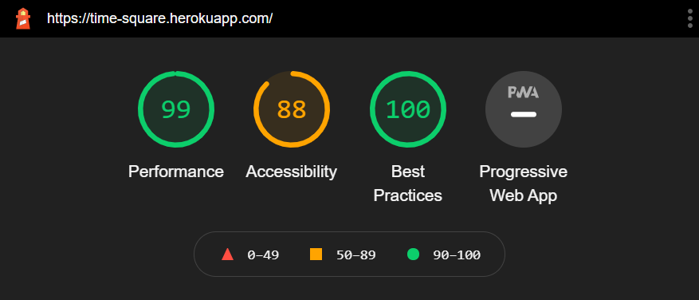
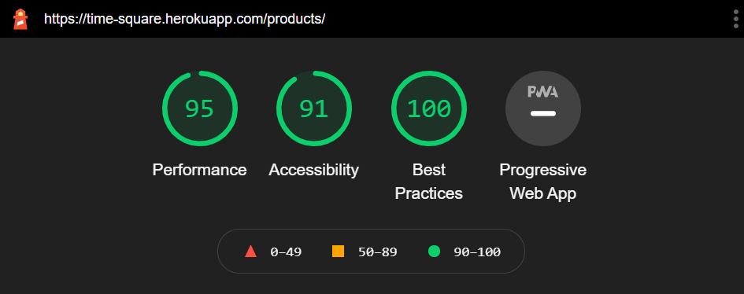
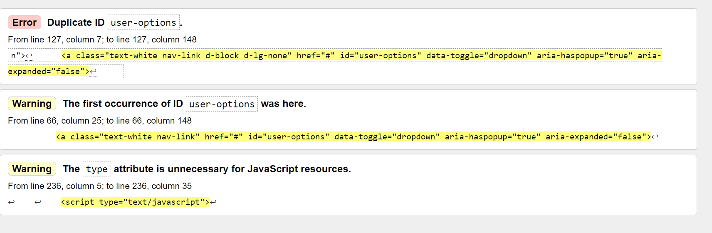
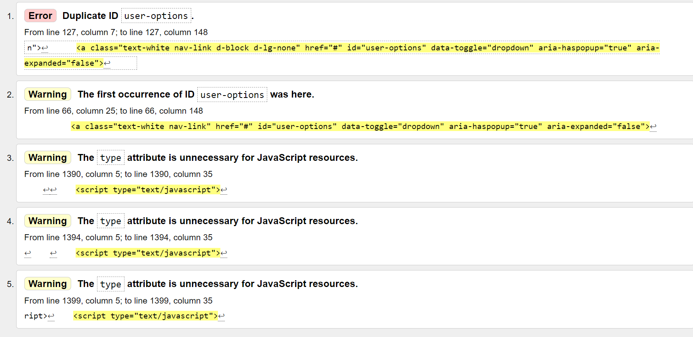

# Testing

## Manual Testing

### General Testing
* Verified if all pages have correct content and functions as required.
* Checked if all links in the navigation bar redirect to the relevant pages.
* Checked if the navigation bar responds appropriately on different screen sizes.
* Checked if the logo and name redirect to the Homepage.
* Checkedif the Home, Account and Shopping Bag links redirect appropriately.
* Checked if the All Products and Brands dropdown filters redirect appropriately.
* Checked if the Search bar appears when clicked and that the search returns the correct matches.

### Homepage
* Checked if the 'Shop Now' button redirects to the Products page.

### Products Page
* Checked if all the products load with the correct information.
* Checked if the 'sort by' filter works and returns the correct products in order.
* Checked if the number of filered results displays correctly.

### Product Detail Page
* Checked if the watch image and product description displays correctly.
* Checked if 'number of weeks' selector correctly adds and subtracts.
* Checked if the 'keep shopping' button redirects to the Products page.
* Checked if the 'add to bag' button displays the success toast alert.
* Checked if the success toast alert 'go to secure checkout' button redirects to the checkout page.
* Checked if the reviews section displays correctly.
* Checked if the 'add review' button displays when users are logged in.
* Checked if the reviews edit/delete functionality only displays against the reviews which have been posted by the logged in user.

### Shopping Bag Page
* Checked if the summary details are displayed correctly.
* Checked if the 'number of weeks' selector can be increased and decreased, then updated.
* Checked if the 'remove' link deletes the item from the shopping bag.
* Checked if the 'keep shopping' button redirects to the Products page.
* Checked if the 'secure checkout' button redirects to the Checkout page.

### Checkout Page
* Checked if the order summary is correct.
* Checked if the user had saved the default information in their profile show up correctly in the checkout form.
* Verified the payment functionality works with successful payments works as desired by filling in the checkout form, adding 4242 4242 4242 4242 in the card number, add 12/24 into MM/YY and 123 into CVC.
* Checked if the overlay animation loads while the form is been submitted.
* Checked if the checkout success page displays the correct information.
* Checked if the user recieves a confirmation email.
* Checked if the 'keep shopping' button redirects to the Products page.

### Profile Page
* Checked if the profile information is saved after purchase and that it can be edited.
* Checked if the logged in users purchase history is displayed correctly.

### Contact Page
* Checked if the form is been displayed correctly.
* Checked if General Query is set as a default option and the other dropddown options are available.
* Checked if the form won't submit if the required fields are left blank.

### Contact page troubleshooting:
---------------------------------
* Checked if the user is redirected to the home with a success message is being displayed but getting server error 500 not allowing form submission.
* Checked if an email was sent letting the admin know about a new contact form submitted but cannot get to that page due to server error.

### 404
* Checked if 404 page displays if user navigates to an invalid link.
* Check if the 'Homepage' button redirects to the homepage.

### 500
Checked if 500 page displays when an internal error happens.
Check if the 'Homepage' button redirects to the homepage.
***

## Responsive Test
* Test responsiveness of website on all screen sizes using different browsers(Google Chome, Opera, Firefox and Microsoft Edge)
* Using Devtools test if everything displays as it should from mobile screens to 1920px desktop screens.
* Viewed on different devices: Iphone XR, Samsung A21, Samsung tablet, medium laptop, large desktop screen.
* Repeated test for all pages.
***

## Automated Testing
### Browser Validation
* Chrome - works correctly.
* Edge - works correctly.
* Safari - works correctly.
* Firefox - works correctly.
* Opera - works correctly.

### Lighthouse Audit
Lighthouse report for Home Page:

  
     

Lighthouse report for products page:

  
     

### W3 HTML validator:

HTML validation for home page:

  
     

The two warnings issued were due to duplicate Ids, however, due to the Ids being defined by bootstrap by default, removing them could have caused unnecessary problems in the page layout. Another issue highlighted is that the type attribute is unnecessary for scripts. I personally prefer to leave it there and don't see it as an issue requiring attention, since linters in most IDEs produce the same tag.

***

HTML validation for products pages:

  
     

Again, duplicate ids and the unnecessary presence of type attribute in script file seems to be the only html validation issue with all pages, including the products page which was tested as seen in the above screenshot, but also product details page, but this is due to the fact that all templates inherit the base template, which includes the bootstrap navigation bar for both desktop and mobile screens, with the issue being present only in he navbar 

[<-- Go Back to README.md](README.md)